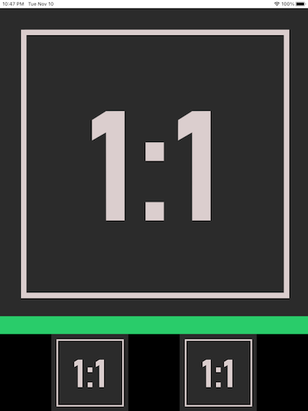
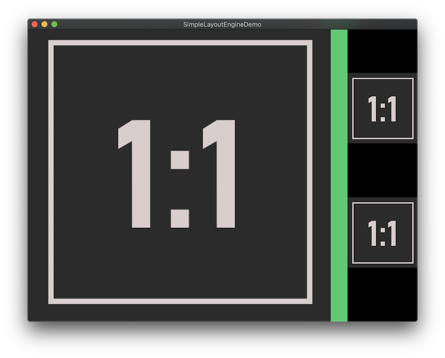
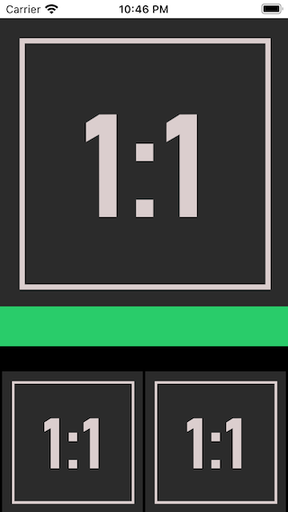
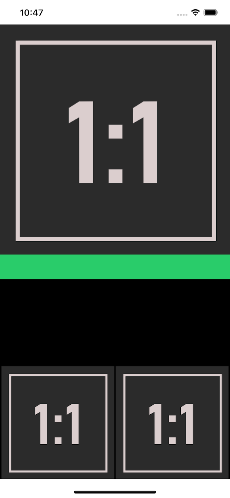

# SimpleLayoutEngine

A simplistic layout engine

Read this: [whackylabs.com/objc/ui/2020/09/15/simple-manual-layout/](https://whackylabs.com/objc/ui/2020/09/15/simple-manual-layout/)

### Swift version

There's also a Swift version available

https://github.com/chunkyguy/SimpleLayoutEngine
More info: [Introducing Simple Layout Engine](https://medium.com/@chunkyguy/introducing-simple-layout-engine-7106a4981202)

### Screenshots

**iPad Pro**

**Mac**

**iPod Touch**

**iPhone 11 Pro Max**

